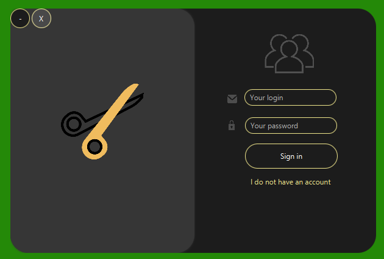
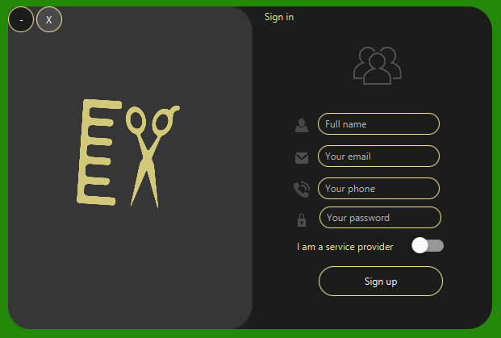
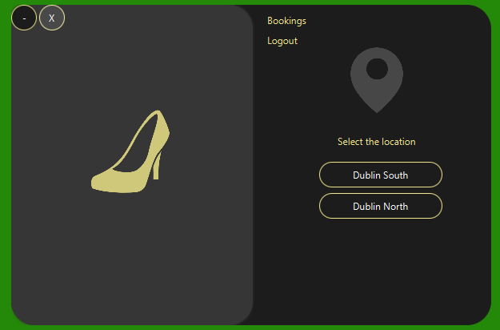

# Easy-Hair-Care: A JavaFX Booking System Application 

Welcome to Easy Hair Care, a user-friendly booking system built with JavaFX. This project is part of an assignment from our college, designed with a sleek and modern interface.

The main colors that define the aesthetic of our application are khaki (yellow), dark grey, and grey, ensuring a smooth user experience.

## Features

- Intuitive and friendly user interface
- Secure system leveraging Spring Security
- Persistent data storage with MySQL

## Technologies Used

- **Frontend:** JavaFX
- **Security:** Spring Security
- **Database:** MySQL
- **Design Pattern:** MVC
- **Libraries:** JFoenix, ControlsFX
- **Others:** Various utility libraries and frameworks

## Screenshots

Take a glimpse of our application:

## Getting Started

These instructions will guide you on how to get a copy of the project up and running on your local machine for development and testing purposes.

### Prerequisites

You need to have the following installed on your system:

- Java Development Kit (JDK)
- MySQL
